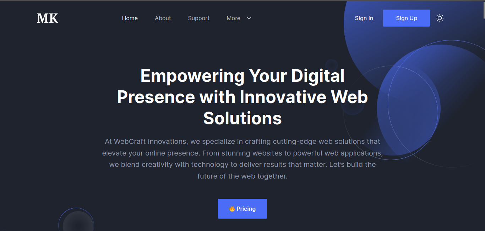
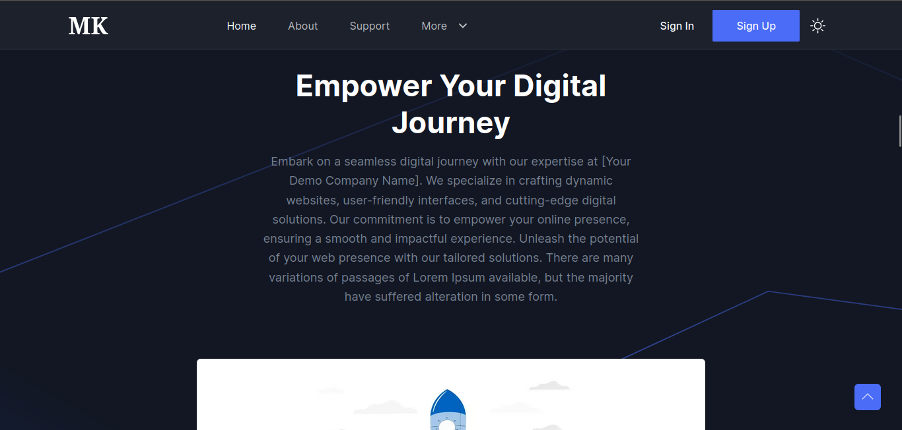
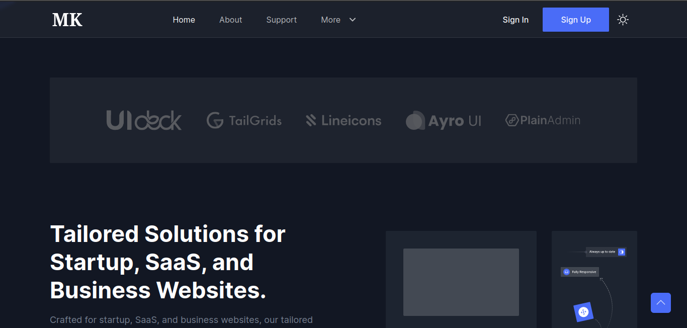
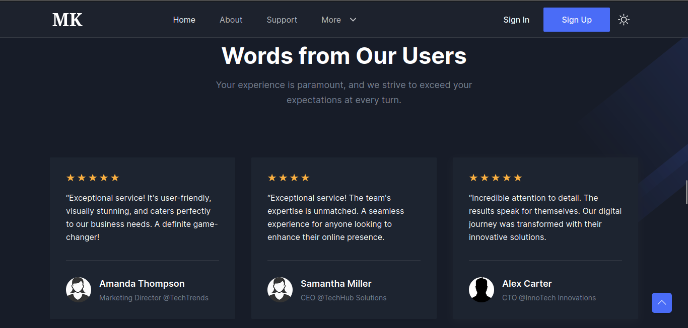
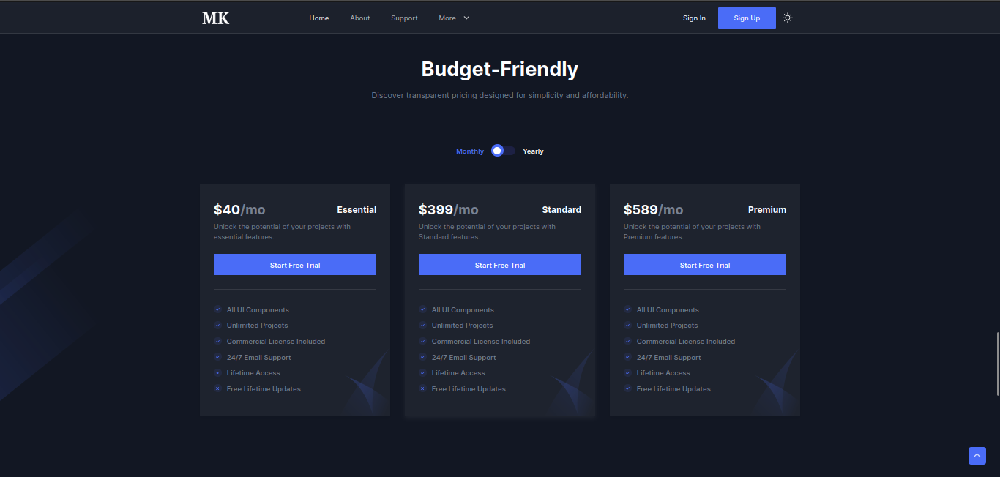
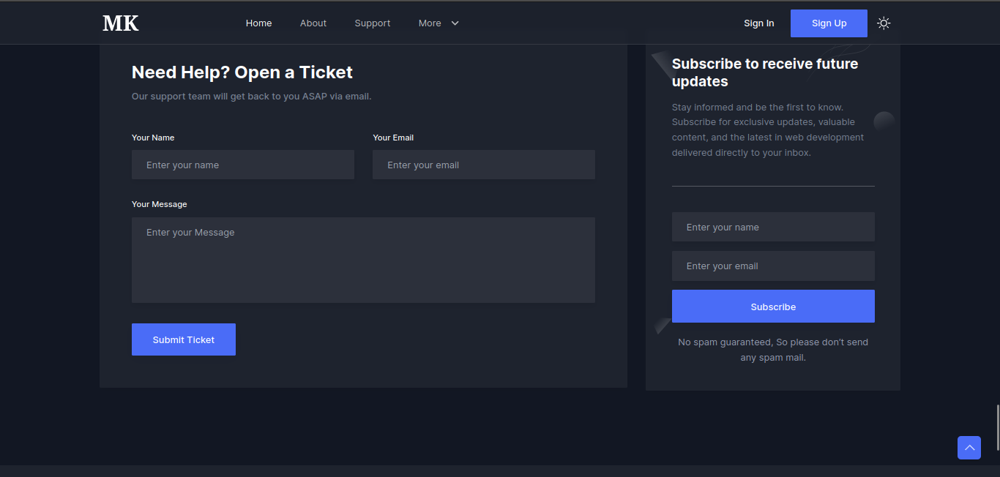

# Next.js Startup Website

## 1.Project Screenshots

### Header

### Services

### Videos

### Brands

### Testimonials

### Prices

### Contact

### Footer


## 2.Folder Structure 

```bash
app/
├── about
│   └── page.tsx
├── blog
│   └── page.tsx
├── blog-details
│   └── page.tsx
├── blog-sidebar
│   └── page.tsx
├── contact
│   └── page.tsx
├── error
│   └── page.tsx
├── layout.tsx
├── page.tsx
├── providers.tsx
├── signin
│   └── page.tsx
└── signup
    └── page.tsx

components/
├── About
│   ├── AboutSectionOne.tsx
│   └── AboutSectionTwo.tsx
├── Blog
│   ├── blogData.tsx
│   ├── index.tsx
│   ├── RelatedPost.tsx
│   ├── SharePost.tsx
│   ├── SingleBlog.tsx
│   └── TagButton.tsx
├── Brands
│   ├── brandsData.tsx
│   └── index.tsx
├── Common
│   ├── Breadcrumb.tsx
│   ├── ScrollUp.tsx
│   └── SectionTitle.tsx
├── Contact
│   ├── index.tsx
│   └── NewsLatterBox.tsx
├── Features
│   ├── featuresData.tsx
│   ├── index.tsx
│   └── SingleFeature.tsx
├── Footer
│   └── index.tsx
├── Header
│   ├── index.tsx
│   ├── menuData.tsx
│   └── ThemeToggler.tsx
├── Hero
│   └── index.tsx
├── Pricing
│   ├── index.tsx
│   ├── OfferList.tsx
│   └── PricingBox.tsx
├── ScrollToTop
│   └── index.tsx
├── Testimonials
│   ├── index.tsx
│   └── SingleTestimonial.tsx
└── Video
    └── index.tsx

```
## [3. Documentation](https://nextjstemplates.com/docs)

## 4. Key Features
- Crafted for Startup and SaaS Business
- Next.js 13 and Tailwind CSS
- All Essential Business Sections and Pages
- High-quality and Clean Design
- Dark and Light Version
- TypeScript Support
and Much More ...

## 📄 5. License
Startup is 100% free and open-source, feel free to use with your personal and commercial projects.
